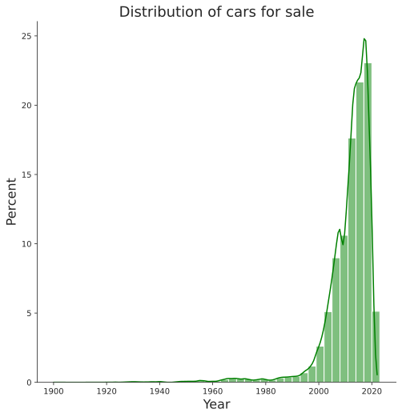
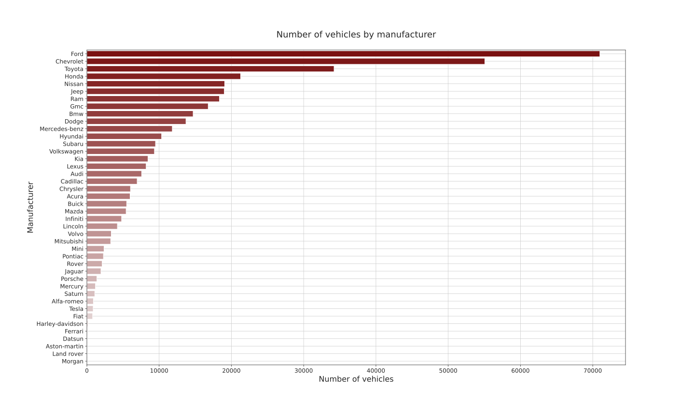

<h1 align="center">Used Cars For Sale In The US Analysis</h1>

Basic analysis regarding cars available for sale in the US at Craiglist

The DataSet is available at: https://www.kaggle.com/austinreese/craigslist-carstrucks-data

<h2 align="center">Analysis made</h2>

### 1. Number of vehicles for sale by vehicle type

### 2. Vehicles prices by type

### 3. Distribution of vehicles for sale

### 4. Number of vehicles by manufacturer

### 5. Vehicles average price by vehicle type and transmission

## License
This repository lies under the MIT License. See <a href="https://github.com/Mr0l3/used-card-analysis/blob/main/LICENSE">LICENSE</a> for more information.
